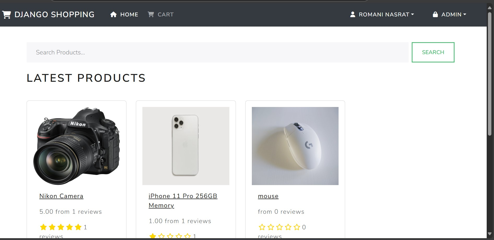
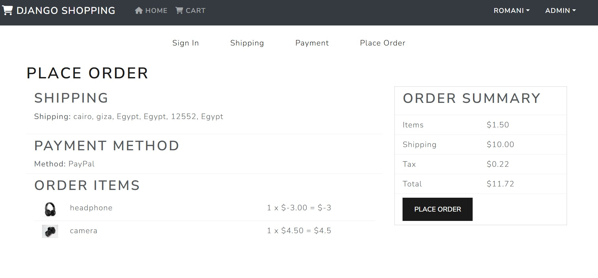
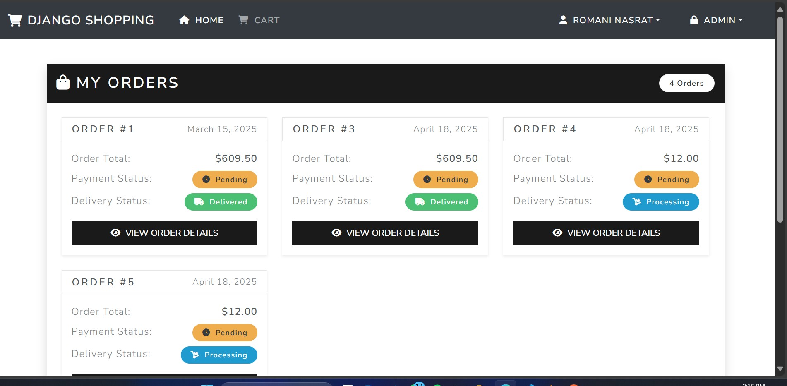

<div align="center" id="top"> 
  

  &#xa0;
</div>

<h1 align="center">Django-Shoping</h1>

<p align="center">
  
  
  
  
  
  
</p>
<div style="display: flex; justify-content: space-around; flex-wrap: wrap; margin-top: 20px;">
 
    
    
    
</div>

<p align="center">
  <a href="#dart-about">About</a> &#xa0; | &#xa0; 
  <a href="#sparkles-features">Features</a> &#xa0; | &#xa0;
  <a href="#rocket-technologies">Technologies</a> &#xa0; | &#xa0;
  <a href="#white_check_mark-requirements">Requirements</a> &#xa0; | &#xa0;
  <a href="#checkered_flag-starting">Starting</a> &#xa0; | &#xa0;
  <a href="#memo-license">License</a> &#xa0; | &#xa0;
  <a href="#heart-contact-me">Contact</a>
</p>

<br>

## :dart: About ##

**Django-Shoping** is a simple E-commerce website built using Django. This project allows users to browse and purchase products. It includes a robust authentication system that enables users to sign up, log in, and log out. The project utilizes a RESTful API for product browsing and purchasing, with JWT (JSON Web Tokens) for secure user authentication and authorization.

This project is designed as a **Full-Stack Training Project**, making it an excellent resource for beginners to learn how to build a full-stack application using Django and React.

you can see the live demo [here](https://django-shopping.vercel.app/)
---

## :sparkles: Features ##


### **Users Can:**
- Register and log in securely.
- Browse and purchase products using **PayPal** .
- View and update their profile information.
- Access their order history.

### **Admin Can:**
- Add, update, and delete products.
- Manage orders and user accounts.
### **General:**
- **RESTful API:** The project uses a RESTful API to handle product browsing and purchasing.
- **JWT Authentication:** The project uses JWT (JSON Web Tokens) for secure user authentication and authorization.
- **PayPal Integration:** The project integrates PayPal for payment processing.
- **Responsive Design:** The project is designed to be responsive and mobile-friendly.
---

## :rocket: Technologies ##

The following tools and frameworks were used in this project:

- **Backend:**
  - [Django](https://www.djangoproject.com/)
  - [Django REST Framework](https://www.django-rest-framework.org/)
  - [django-simple-jwt](https://django-rest-framework-simplejwt.readthedocs.io/en/latest/)
  - [AWS S3](https://aws.amazon.com/s3/) for file storage.
  - [AWS RDS](https://aws.amazon.com/rds/) for database management.
  - [Cloudinary Storage](https://pypi.org/project/django-cloudinary-storage/) for media storage.

- **Frontend:**
  - [React](https://reactjs.org/)
  - [React Bootstrap](https://react-bootstrap.github.io/)
  - [Axios](https://axios-http.com/) for API requests.

- **Payment Integration:**
  - [PayPal](https://developer.paypal.com/docs/api-basics/)

---

## :white_check_mark: Requirements ##

Before starting, ensure you have the following installed:

- Python 3.x
- Node.js
- npm (Node Package Manager)
- PostgreSQL (or any other database supported by Django)

---

## :checkered_flag: Starting ##

```bash
# Clone this project
$ git clone https://github.com/romanyn36/Django-react-e-commerce.git

# Navigate to the project directory
$ cd Django-react-e-commerce

# Create a virtual environment
$ python -m venv venv

# Activate the virtual environment
$ source venv/bin/activate  # For Linux/Mac
$ venv\Scripts\activate     # For Windows

# Install backend dependencies
$ pip install -r requirements.txt

# Set up environment variables in a .env file
# Example: SECRET_KEY, DATABASE_URL, etc.

# Migrate the database
$ python manage.py migrate

# Run the Django server
$ python manage.py runserver

# please create a superuser to access the admin panel and update email field in the user model http://127.0.0.1:8000/admin
# then login to http://localhost:3000/ you can see the admin panel in the top right corner 
# this won't be visible to the normal users

# Navigate to the frontend directory
$ cd frontend

# Install frontend dependencies
$ npm install

# Start the React development server
$ npm start

# The frontend will be available at http://localhost:3000/

 ```
:memo: License
This project is licensed under the MIT License. For more details, see the LICENSE file.


- Made by Romani – an AI Engineer and Django Developer. Feel free to reach out for collaborations, questions, or new projects!

<p align="center"> <a href="https://github.com/romanyn36" target="_blank">  </a> <a href="https://linkedin.com/in/romanyn36" target="_blank">  </a> <a href="https://twitter.com/romaninasrat" target="_blank">  </a> <a href="https://www.instagram.com/romanyn36" target="_blank">  </a> </p>
<a href="#top">Back to top</a>


